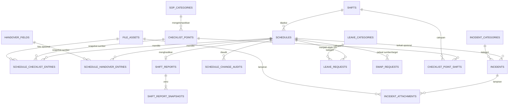
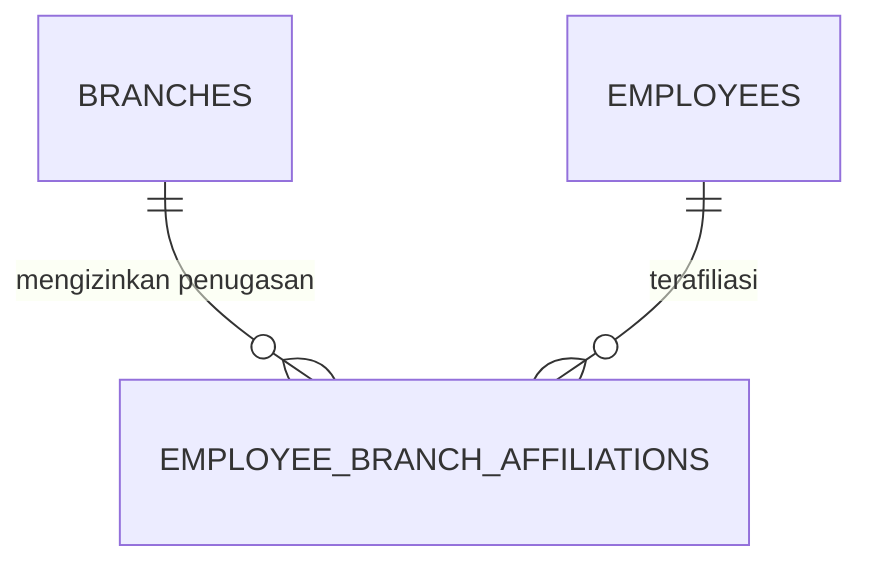

# Rancangan Kebutuhan Database MYSHIFT

> **Status:** Usulan rancangan logis untuk evaluasi; bukan migrasi atau perubahan stack yang sudah disetujui.  
> **Tanggal:** 2026-09-30  
> **Sumber domain saat ini:** `FULL-PRD.md`, `API-CONTRACT.md`, `SHEETS-SCHEMA.md`, dan `CHECKLIST-SPECS.md`.

## 1. Tujuan dan batas rancangan

Dokumen ini merancang kebutuhan data seolah-olah MYSHIFT menggunakan database relasional, dengan **satu database pusat/Registry dan satu database operasional untuk setiap cabang**. Fokusnya adalah tabel, kunci, relasi, isolasi data, dan aturan integritasnya.

Ini **tidak** mengganti keputusan implementasi MYSHIFT saat ini: `FULL-PRD.md` masih menetapkan Google Sheets API v4 sebagai penyimpanan. Dokumen ini adalah rancangan target/alternatif untuk dibahas sebelum ada keputusan migrasi. Tidak ada tabel, migrasi, atau koneksi database yang dibuat oleh dokumen ini.

### Prinsip desain

1. Data identitas global hidup di Registry; data kerja operasional hidup di database cabang.
2. Setiap jadwal menyimpan cabang sebagai konteks yang otoritatif. Checklist, handover, swap, izin, dan laporan untuk jadwal itu mengikuti cabang tersebut, bukan cabang pilihan Petugas.
3. Semua entitas memiliki primary key stabil. ID bisnis yang terbaca manusia tetap disediakan dan unik di dalam cabang.
4. Relasi dalam database cabang ditegakkan dengan foreign key dan unique constraint. Referensi ke Registry yang berada di database lain divalidasi oleh service aplikasi.
5. Data historis tidak dihapus hanya karena master dinonaktifkan atau berubah. Gunakan soft-delete untuk master dan snapshot untuk label/template yang harus tetap sama di laporan lama.
6. Semua waktu disimpan sebagai timestamp UTC; tanggal operasional dan interpretasi waktu memakai timezone cabang (default `Asia/Jakarta`).
7. PIN hanya disimpan sebagai hash scrypt beserta salt/parameter yang dibutuhkan format hash; tidak ada PIN plaintext.

## 2. Batas database dan relasi lintas database

```text
MYSHIFT Registry (database pusat)
  branches ──────────────── menentukan database operasional cabang
  employees ──< employee_branch_affiliations >── branches
  app_settings

Database Cabang A                   Database Cabang B
  shifts                               shifts
  schedules                            schedules
  swap_requests                        swap_requests
  leave_requests                       leave_requests
  checklist templates + entries        checklist templates + entries
  handover templates + entries         handover templates + entries
  incidents                            incidents
  shift reports + audit                shift reports + audit
```

`employee_id` dalam database cabang adalah referensi logis ke `Registry.employees.employee_id`, bukan foreign key SQL lintas database. Demikian pula `approved_by`, `created_by`, dan `actor_employee_id`. Sebelum menerima operasi, backend harus memastikan akun masih aktif, role-nya benar, dan memiliki afiliasi cabang yang sesuai.

Jangan mengandalkan nama tabel saja untuk menentukan tenant. Setiap request operasional harus memvalidasi cabang dari jadwal/entitas yang diminta dan baru mengakses database cabang terkait. Jangan menerima identifier jadwal dari satu cabang lalu mencarinya diam-diam di cabang lain.

## 3. Database pusat — Registry

### 3.1 `branches`

Satu baris mewakili satu cabang dan alamat database operasionalnya.

| Kolom | Tipe logis | Aturan |
|---|---|---|
| `branch_id` | UUID | PK internal stabil |
| `public_id` | varchar | ID bisnis seperti `CBG001`; unique |
| `name` | varchar | Wajib |
| `active` | boolean | Soft-disable; tidak menghapus data cabang |
| `timezone` | varchar | Wajib; default `Asia/Jakarta` |
| `database_ref` | secret/reference | Referensi koneksi yang dikelola secret manager, bukan password mentah |
| `provision_status` | enum | `pending`, `ready`, `failed` |
| `created_at`, `updated_at` | timestamptz | Wajib |

`database_ref` sebaiknya berupa key/alias yang hanya bisa diselesaikan oleh backend. Jangan menyimpan kredensial database di row yang dapat dibaca client.

### 3.2 `employees`

Satu identitas login global. Akun Admin tidak wajib terafiliasi ke cabang tertentu.

| Kolom | Tipe logis | Aturan |
|---|---|---|
| `employee_id` | UUID | PK internal stabil |
| `public_id` | varchar | ID bisnis `EMP-###`; unique |
| `username` | varchar | Wajib, unique case-insensitive, disimpan normalized lowercase |
| `normalized_username` | varchar | Nilai lowercase hasil normalisasi; unique constraint diterapkan di kolom ini |
| `pin_hash` | varchar | Hash scrypt; tidak pernah dikirim ke client |
| `name` | varchar | Wajib |
| `role` | enum | `admin`, `petugas` |
| `active` | boolean | Soft-disable akun |
| `failed_login_attempts` | integer | Default 0, tidak negatif |
| `locked_until` | timestamptz nullable | Lockout sementara |
| `created_at`, `updated_at`, `deactivated_at` | timestamptz nullable | Audit lifecycle akun |

Unique constraint: `UNIQUE (normalized_username)`. `normalized_username` dapat berupa kolom generated/computed bila engine mendukungnya, atau ditulis oleh service dengan normalisasi yang sama.

### 3.3 `employee_branch_affiliations`

Relasi many-to-many antara Petugas dan cabang yang boleh menerima penugasannya.

| Kolom | Tipe logis | Aturan |
|---|---|---|
| `employee_id` | FK `employees.employee_id` | PK bagian |
| `branch_id` | FK `branches.branch_id` | PK bagian |
| `active` | boolean | Menonaktifkan afiliasi tanpa menghapus riwayat |
| `created_at` | timestamptz | Wajib |

Primary key: `(employee_id, branch_id)`. Jadwal baru untuk Petugas hanya boleh dibuat pada cabang dengan afiliasi aktif. Menghapus afiliasi tidak menghapus jadwal historis.

### 3.4 `app_settings`

Konfigurasi global sederhana.

| Kolom | Tipe logis | Aturan |
|---|---|---|
| `setting_key` | varchar | PK |
| `setting_value` | text/json | Wajib; tidak untuk menyimpan secret |
| `updated_at` | timestamptz | Wajib |

Secret seperti key HMAC, PIN, kredensial Google/DB, dan token bridge disimpan di secret manager/environment platform, bukan tabel ini.

## 4. Database operasional per cabang

Masing-masing database cabang memiliki struktur yang sama, tetapi hanya berisi data cabang tersebut. Database disiapkan melalui migrasi versi skema yang sama. ID bisnis boleh berulang antar database; saat melintasi database identitas record adalah gabungan `(branch_id, public_id)` atau identifier internal global.

### 4.1 Tabel master operasional

#### `shifts`

Template shift milik cabang.

| Kolom | Tipe logis | Aturan |
|---|---|---|
| `shift_id` | UUID | PK |
| `public_id` | varchar | ID tampilan seperti `SFT-001`, unique dalam cabang |
| `name` | varchar | Wajib |
| `start_time`, `end_time` | time | Wajib; validasi durasi lintas tengah malam di domain |
| `active` | boolean | Soft-disable |
| `created_at`, `updated_at` | timestamptz | Wajib |

Relasi: satu `shift` dapat dipakai banyak `schedules`.

#### `leave_categories`

Kategori izin yang dapat dipilih Petugas.

Kolom: `category_id` PK, `public_id` (`KTG-###`, unique), `label`, `active`, `created_at`, `updated_at`.

Relasi: satu kategori memiliki banyak `leave_requests`. Kategori yang sudah dipakai dinonaktifkan, bukan dihapus.

#### `sop_categories`

Kelompok checklist SOP.

Kolom: `sop_category_id` PK, `public_id` (`SOP-###`, unique), `name`, `display_order`, `active`, `created_at`, `updated_at`.

Relasi: satu kategori berisi banyak `checklist_points`.

#### `checklist_points`

Master definisi checklist saat ini.

| Kolom | Tipe logis | Aturan |
|---|---|---|
| `point_id` | UUID | PK |
| `public_id` | varchar | ID seperti `CHK-001`, unique |
| `sop_category_id` | FK | Wajib |
| `description` | text | Wajib |
| `completion_type` | enum | `centang`, `centang_foto`, `angka`, `teks`, `pilihan` |
| `unit` | varchar nullable | Digunakan oleh tipe angka |
| `min_value`, `max_value` | numeric nullable | `min_value <= max_value` jika keduanya ada |
| `options` | json/array nullable | Pilihan untuk tipe `pilihan` |
| `display_order` | integer | Default 0 |
| `active` | boolean | Soft-disable |
| `created_at`, `updated_at` | timestamptz | Wajib |

#### `checklist_point_shifts`

Menggantikan flag boolean + comma-separated `Shift_IDs` dengan relasi yang dapat divalidasi.

Kolom: `point_id` FK, `shift_id` FK; primary key `(point_id, shift_id)`.

Tambahkan `applies_to_all_shifts` pada `checklist_points`. Jika `true`, relasi pada tabel ini tidak diperlukan; jika `false`, minimal satu baris cakupan shift diwajibkan. Validasi konsistensi ini berada di service/database trigger bila didukung.

#### `handover_fields`

Definisi template form handover.

Kolom: `handover_field_id` PK, `public_id` (`HOF-###`, unique), `label`, `is_required`, `display_order`, `active`, `created_at`, `updated_at`.

### 4.2 Jadwal dan siklus shift

#### `schedules`

Entitas pusat seluruh aktivitas suatu shift.

| Kolom | Tipe logis | Aturan |
|---|---|---|
| `schedule_id` | UUID | PK |
| `public_id` | varchar | Format `SCH-YYYYMMDD-###`, unique dalam database cabang |
| `employee_id` | string/UUID Registry | Referensi logis lintas database |
| `employee_name_snapshot` | varchar | Snapshot nama saat jadwal dibuat/ditetapkan untuk riwayat |
| `shift_id` | FK `shifts.shift_id` | Wajib |
| `shift_name_snapshot` | varchar | Snapshot nama template saat jadwal dibuat |
| `shift_start_snapshot`, `shift_end_snapshot` | time | Snapshot jam template saat jadwal dibuat |
| `work_date` | date | Tanggal kerja lokal cabang |
| `status` | enum | `scheduled`, `started`, `completed`, `cancelled`* |
| `started_at` | timestamptz nullable | Penanda mulai shift; bukan absensi formal |
| `report_generated_at` | timestamptz nullable | Waktu laporan dibuat |
| `created_by_employee_id` | Registry employee ID | Referensi logis; aktor admin |
| `created_at`, `updated_at` | timestamptz | Wajib |

`* cancelled` adalah usulan tambahan untuk pembatalan yang aman. Jika belum diperlukan oleh alur produk, jangan aktifkan sampai enum API dan business rules diperbarui.

Constraint:

- `UNIQUE (public_id)`.
- Duplikat penugasan identik dilarang: `UNIQUE (employee_id, shift_id, work_date)`; jika bisnis mengizinkan jadwal identik berulang, constraint harus diganti dengan aturan domain yang eksplisit.
- `employee_id` wajib merujuk akun Registry aktif dengan afiliasi ke cabang ini pada saat jadwal dibuat. Pemeriksaan lintas database dilakukan aplikasi.
- Bentrok jam shift ditampilkan sebagai warning sesuai PRD, bukan hard constraint database.
- Perubahan nama/jam shift template tidak boleh mengubah konteks historis jadwal karena snapshot dipertahankan.

Relasi: `schedules.shift_id → shifts.shift_id`; satu jadwal memiliki checklist entries, handover entries, incidents (opsional), satu laporan shift, dan pengajuan izin/swap.

### 4.3 Swap dan izin

#### `swap_requests`

Permintaan swap harus menunjuk **kedua jadwal yang akan ditukar**, supaya pihak, tanggal, dan shift yang terdampak eksplisit dan tidak berubah bila jadwal target diedit kemudian.

| Kolom | Tipe logis | Aturan |
|---|---|---|
| `swap_request_id` | UUID | PK |
| `public_id` | varchar | `SWP-###`, unique dalam cabang |
| `requester_schedule_id` | FK `schedules.schedule_id` | Jadwal pemohon |
| `target_schedule_id` | FK `schedules.schedule_id` | Jadwal pasangan yang disetujui untuk ditukar |
| `requested_by_employee_id` | Registry employee ID | Wajib; harus pemilik jadwal pemohon |
| `requested_with_employee_id` | Registry employee ID | Harus pemilik jadwal target |
| `reason` | text | Wajib |
| `status` | enum | `pending`, `approved`, `rejected`, `cancelled` |
| `decided_by_employee_id` | Registry employee ID nullable | Admin yang memutuskan |
| `decided_at` | timestamptz nullable | Waktu keputusan |
| `reject_reason` | text nullable | Alasan penolakan |
| `created_at`, `updated_at` | timestamptz | Wajib |

Constraint: kedua jadwal harus berbeda; satu pemohon tidak dapat memiliki lebih dari satu swap pending per jadwal sumber; jadwal target tidak boleh diklaim dua swap pending aktif sekaligus. Gunakan partial unique index bila DB mendukung, ditambah transaksi/locking saat approval. Pengesahan menukar kedua `employee_id` dalam satu transaksi.

#### `leave_requests`

| Kolom | Tipe logis | Aturan |
|---|---|---|
| `leave_request_id` | UUID | PK |
| `public_id` | varchar | `IZN-###`, unique dalam cabang |
| `schedule_id` | FK `schedules.schedule_id` | Wajib |
| `requested_by_employee_id` | Registry employee ID | Harus pemilik jadwal |
| `category_id` | FK `leave_categories.category_id` | Wajib |
| `note` | text | Wajib |
| `status` | enum | `pending`, `approved`, `rejected`, `cancelled` |
| `decided_by_employee_id` | Registry employee ID nullable | Admin yang memutuskan |
| `decided_at` | timestamptz nullable | Waktu keputusan |
| `reject_reason` | text nullable | Alasan penolakan |
| `created_at`, `updated_at` | timestamptz | Wajib |

Constraint: satu pengajuan izin pending per jadwal. Persetujuan izin tidak boleh menghapus jadwal atau merusak historinya; definisikan terpisah apakah approval membatalkan jadwal secara status/relasi sesuai aturan bisnis.

### 4.4 Checklist dan handover per jadwal

#### `schedule_checklist_entries`

Menyimpan jawaban terbaru satu point untuk satu jadwal. Saat jadwal dibuat atau checklist pertama kali dibuka, buat snapshot item yang berlaku untuk shift tersebut. Snapshot ini mencegah perubahan template mengubah checklist historis.

| Kolom | Tipe logis | Aturan |
|---|---|---|
| `entry_id` | UUID | PK |
| `schedule_id` | FK `schedules.schedule_id` | Wajib |
| `checklist_point_id` | FK `checklist_points.point_id` nullable | Referensi master; boleh null saat master diarsipkan/dihapus secara administratif |
| `point_public_id_snapshot` | varchar | ID point saat disalin |
| `category_name_snapshot` | varchar | Nama SOP saat disalin |
| `description_snapshot` | text | Deskripsi saat disalin |
| `completion_type_snapshot` | enum/varchar | Jenis isian saat disalin |
| `unit_snapshot`, `min_snapshot`, `max_snapshot`, `options_snapshot` | nullable | Aturan tampilan/validasi historis |
| `is_required_snapshot` | boolean | Point wajib saat jadwal dibuat |
| `value` | text nullable | Jawaban terkini |
| `photo_asset_id` | FK `file_assets.asset_id` nullable | Bukti foto |
| `checked_by_employee_id` | Registry employee ID nullable | Pengisi terakhir |
| `checked_at` | timestamptz nullable | Waktu update terakhir |

Constraint: `UNIQUE (schedule_id, point_public_id_snapshot)`; jawaban divalidasi backend menurut `completion_type_snapshot`. Penyelesaian shift hanya diizinkan jika semua entry wajib pada snapshot lengkap.

#### `schedule_handover_entries`

Jawaban handover terbaru per jadwal/field template.

Kolom penting: `entry_id` PK, `schedule_id` FK, `handover_field_id` FK nullable, `field_public_id_snapshot`, `label_snapshot`, `is_required_snapshot`, `value`, `created_by_employee_id` (Registry reference), `created_at`, `updated_at`.

Constraint: `UNIQUE (schedule_id, field_public_id_snapshot)`. Field dan kewajiban disalin ke snapshot ketika jadwal memulai proses operasional agar update template tidak mengubah batas submit untuk shift yang sedang berjalan. Shift tidak dapat ditutup bila snapshot field wajib belum terisi.

#### `schedule_change_audits`

Audit append-only untuk edit checklist/handover setelah laporan dibuat dan perubahan administratif penting.

Kolom: `audit_id` PK, `schedule_id` FK, `section` enum (`checklist`, `handover`, `schedule`), `record_public_id`, `field_name`, `old_value`, `new_value`, `actor_employee_id` (Registry reference), `actor_name_snapshot`, `changed_at`.

Aplikasi hanya melakukan `INSERT`; role operasional biasa tidak mendapat izin `UPDATE`/`DELETE` atas tabel audit.

### 4.5 Incident dan bukti file

#### `incident_categories`

Kolom: `incident_category_id` PK, `public_id` (`KIC-###`, unique), `label`, `active`, `created_at`, `updated_at`.

#### `incidents`

| Kolom | Tipe logis | Aturan |
|---|---|---|
| `incident_id` | UUID | PK |
| `public_id` | varchar | `INC-###`, unique dalam cabang |
| `category_id` | FK `incident_categories.incident_category_id` | Wajib |
| `schedule_id` | FK `schedules.schedule_id` nullable | Jadwal terkait jika diketahui |
| `description` | text | Wajib, min 10 karakter sesuai PRD |
| `severity` | enum | `low`, `medium`, `high` |
| `status` | enum | `open`, `resolved` |
| `created_by_employee_id` | Registry employee ID | Referensi logis |
| `resolved_by_employee_id` | Registry employee ID nullable | Admin yang menyelesaikan |
| `resolved_at` | timestamptz nullable | Konsisten dengan status |
| `created_at`, `updated_at` | timestamptz | Wajib |

Relasi: kategori wajib; schedule opsional; pembuat dan penyelesai adalah referensi logis Registry. Record resolved tetap dipertahankan.

#### `file_assets`

Metadata file; isi file tetap berada di Drive/object storage, bukan blob besar di database.

Kolom: `asset_id` PK, `provider`, `provider_file_id`, `storage_path`/URL privat, `mime_type`, `size_bytes`, `checksum`, `uploaded_by_employee_id` (Registry reference), `created_at`.

Constraint: `size_bytes > 0`; MIME type allowlist; unique provider/file ID. Jangan menyimpan akses token Drive atau URL publik yang dapat memberi akses lebih luas dari kebijakan aplikasi.

Relasi file dibuat melalui FK eksplisit dari checklist entry atau tabel tambahan `incident_attachments` (PK `(incident_id, asset_id)`). Tabel junction incident mendukung batas satu foto saat ini dan dapat diperluas bila scope berubah.

### 4.6 Laporan shift

#### `shift_reports`

Satu laporan dibuat paling banyak sekali per jadwal, namun dapat merepresentasikan data terkini setelah koreksi yang diaudit.

| Kolom | Tipe logis | Aturan |
|---|---|---|
| `shift_report_id` | UUID | PK |
| `schedule_id` | FK `schedules.schedule_id` | Unique; satu laporan per jadwal |
| `generated_by_employee_id` | Registry employee ID | Pemilik jadwal atau Admin |
| `generated_at` | timestamptz | Wajib |
| `public_token_hash` | varchar nullable | Simpan hash token publik, bukan token mentah jika token dapat diverifikasi dengan cara tersebut |
| `public_access_revoked_at` | timestamptz nullable | Mencabut akses publik |
| `created_at`, `updated_at` | timestamptz | Wajib |

#### `shift_report_snapshots`

Snapshot immutable pada saat laporan pertama kali diterbitkan.

Kolom: `snapshot_id` PK, `shift_report_id` FK, `revision` integer, `snapshot_data` JSON, `created_at`, `created_by_employee_id` Registry reference.

Constraint: `UNIQUE (shift_report_id, revision)`. Jika produk memutuskan tautan laporan selalu menampilkan versi terbaru, simpan snapshot/revision setiap kali data pasca-generate berubah; jika tautan menunjukkan keadaan saat generate, pertahankan snapshot pertama dan tampilkan audit sebagai addendum. Keputusan perilaku publik ini harus konsisten di API dan UI.

### 4.7 Tabel migrasi/operasional

#### `schema_migrations`

Kolom: `version` PK, `applied_at`, `checksum` nullable. Setiap cabang harus berada pada versi migrasi yang didukung sebelum menerima traffic.

#### `id_sequences` (opsional)

Jika public ID tetap memakai urutan bisnis, simpan counter atomik per jenis ID/tanggal. Jangan menghitung `MAX(id)+1` tanpa lock/transaksi karena request paralel dapat menghasilkan ID duplikat. UUID internal lebih disarankan sebagai PK, sementara public ID dihasilkan melalui sequence transaksional.

## 5. ERD ringkas database cabang



`EMPLOYEES` dan `BRANCHES` berada di Registry dan karena itu tidak digambar sebagai foreign key SQL dalam ERD cabang. Semua kolom `*_employee_id` adalah logical reference lintas database.

## 6. Relasi Registry



## 7. Indeks yang diperlukan

- Registry: unique normalized username; index `(active, role)`; affiliation index `(branch_id, active, employee_id)`.
- Jadwal: unique public ID; index `(work_date, status)`; index `(employee_id, work_date)`; index `(shift_id, work_date)`.
- Checklist/handover: unique `(schedule_id, point/field snapshot ID)` dan index schedule ID.
- Swap/izin: index `(status, created_at)`, `(requested_by/employee_id, created_at)`, serta partial unique constraint untuk permintaan pending yang mencegah klaim ganda.
- Incident: index `(status, severity, created_at)`, `(category_id, created_at)`, dan `(schedule_id)`.
- Audit: index `(schedule_id, changed_at)`, jangan index nilai teks besar tanpa kebutuhan query terukur.
- Laporan: unique `schedule_id`; unique `(shift_report_id, revision)`.

## 8. Transaksi dan integritas bisnis

1. **Membuat jadwal:** validasi cabang aktif, akun Petugas aktif dan berafiliasi, template shift aktif; insert schedule dan snapshot checklist/handover dalam transaksi satu database cabang.
2. **Mulai shift:** hanya transisi `scheduled → started`; tulis `started_at` satu kali. Ini timestamp proses, bukan catatan absensi.
3. **Menutup shift / generate report:** baca snapshot checklist/handover, validasi semua kewajiban server-side, kemudian update lifecycle dan insert report/snapshot secara atomik.
4. **Swap approval:** lock kedua jadwal dan request; pastikan masih pending dan keduanya dapat ditukar; perbarui pemilik kedua jadwal dalam satu transaksi cabang; simpan keputusan.
5. **Izin approval:** lock request/jadwal terkait, pastikan request pending, kemudian simpan keputusan dan perubahan status jadwal sesuai aturan produk yang disetujui.
6. **Koreksi pasca-laporan:** update jawaban terkini dan append audit dalam transaksi yang sama.
7. **Delete:** soft-delete master/akun. Data operasional dan referensi historis tidak dihapus melalui cascade.
8. **Lintas Registry/cabang:** tidak ada transaksi SQL atomik melintasi database. Gunakan validasi Registry sebelum operasi cabang; untuk operasi yang memerlukan dua penulisan lintas database, gunakan state machine/outbox/idempotency dan mekanisme rekonsiliasi, jangan mengasumsikan transaksi terdistribusi.

## 9. Kebijakan penyimpanan dan keamanan

- Semua mutasi penting memiliki `created_at`/`updated_at`; event keputusan dan edit pasca-laporan bersifat append-only.
- Akun/cabang/template yang sudah direferensikan dinonaktifkan, bukan dihapus permanen.
- Jadwal menyimpan snapshot nama Petugas/shift dan field checklist/handover agar laporan lama tetap bisa dibaca setelah data master berubah.
- Data PIN hash tidak boleh muncul di DTO publik, log, audit teks, export, atau report.
- Hak akses DB dipisah: runtime hanya mendapat hak minimum; migration role terpisah; audit tidak dapat dihapus role aplikasi.
- Backup/restore dilakukan per cabang dan Registry. Restore harus memverifikasi `branch_id`, versi skema, dan referensi akun yang masih ada.
- Kebijakan retensi audit, incident, foto, dan token laporan publik perlu ditentukan sebelum produksi; jangan menghapus record yang masih dibutuhkan untuk laporan/audit tanpa kebijakan eksplisit.

## 10. Ringkasan tabel

| Ruang lingkup | Tabel |
|---|---|
| Registry | `branches`, `employees`, `employee_branch_affiliations`, `app_settings` |
| Cabang — master | `shifts`, `leave_categories`, `sop_categories`, `checklist_points`, `checklist_point_shifts`, `handover_fields`, `incident_categories` |
| Cabang — operasi | `schedules`, `swap_requests`, `leave_requests`, `schedule_checklist_entries`, `schedule_handover_entries`, `incidents` |
| Cabang — laporan/audit | `schedule_change_audits`, `shift_reports`, `shift_report_snapshots` |
| Cabang — file/infra | `file_assets`, `incident_attachments`, `schema_migrations`, `id_sequences` (opsional) |

## 11. Keputusan yang perlu disepakati sebelum implementasi DB

1. **Tetap Sheets atau migrasi relasional:** dokumen ini belum mengubah stack wajib Google Sheets API v4.
2. **Isolasi tenant:** database fisik per cabang memberi isolasi kuat tetapi menambah biaya provisioning, migrasi, monitoring, backup, dan query lintas cabang. Alternatifnya satu database dengan `branch_id` dan row-level security; perlu keputusan eksplisit.
3. **Public ID:** pertahankan format `EMP-###`, `CBG###`, `SCH-YYYYMMDD-###` untuk UX, tetapi gunakan PK stabil dan pencegahan collision yang aman.
4. **Swap:** UI/API harus menunjuk jadwal pasangan secara eksplisit, bukan hanya nama Petugas target.
5. **Izin yang disetujui:** tentukan apakah jadwal dibatalkan, diganti status, atau tetap planned dengan izin terhubung.
6. **Laporan publik setelah koreksi:** tentukan apakah URL menampilkan snapshot pertama, versi terkini, atau keduanya melalui revision history.
7. **Riwayat template:** setujui kapan snapshot checklist/handover dibuat (saat jadwal dibuat atau saat shift dimulai) dan aturan perubahan jadwal setelah snapshot.
